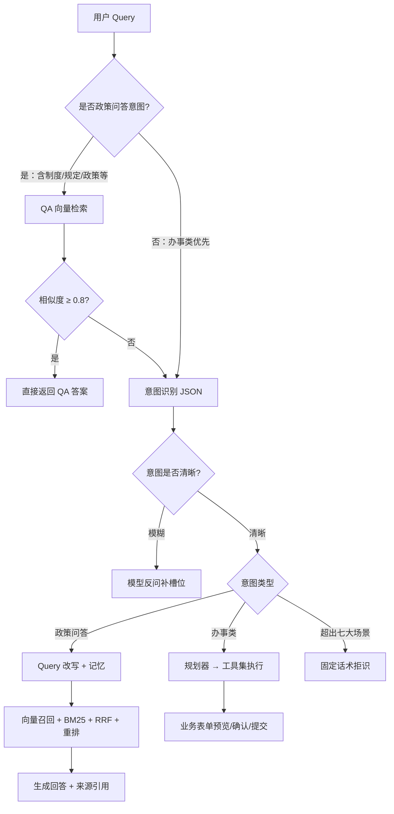
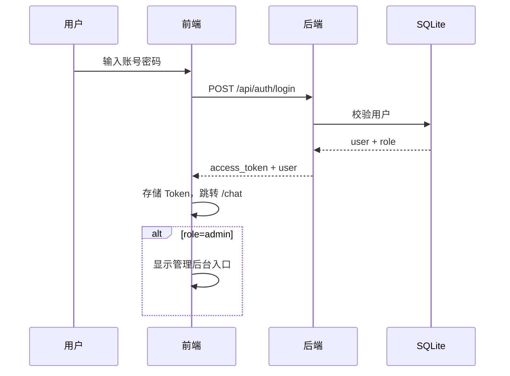
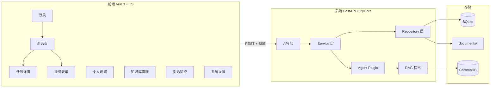

# 智能办公助手 Agent — 产品需求文档（PRD 定稿）

> 版本：C 阶段定稿 · 2026-08-27  
> 来源：智能办公助手 V1.1 需求文档 + 阶段 A/B 对齐确认 + 原型审核通过  
> 状态：**阶段 C 已完成，可进入开发**

---

## 1. 背景与目标

### 1.1 需求背景

国能集团（智能矿山事业部）员工日常办公中，邮件撰写、会议预约、差旅申请与报销、工包填报等操作分散在邮箱、OA、国能 ICE 等系统中，流程繁琐、重复劳动多。

### 1.2 Mission

构建面向集团员工的 **Web 智能办公助手 Agent**，通过自然语言对话完成办公问答与办事提单，降低跨系统操作成本。

### 1.3 Persona

| 角色 | 描述 |
|------|------|
| 普通员工 | 使用对话页发起问答/办事；查看历史会话；使用知识库帮助页；管理个人设置（主题/账号/版本/记忆） |
| 管理员 | 具备普通员工全部能力；额外拥有知识库管理、对话监控、系统设置权限 |

### 1.4 投入产出（来源 PRD）

- 预计 2 年投入 230 万，上线后每年节约约 2 万人·天

---

## 2. 版本规划（终版）

### 2.1 V1 / MVP

| 能力 | V1 范围 | 说明 |
|------|---------|------|
| 邮件助手 | ✅ | 撰写/优化/发送/撤回（Mock 或对接下游，开发阶段定） |
| 会议助手 | ✅ | 国能会议创建、会邀邮件、线下会议室预约 |
| 差旅助手 | ✅ | 差旅申请、订票、酒店、报销 |
| 工包助手 | ✅ | 工包管理、工包填报 |
| 差旅报销政策问答 | ✅ | QA 直出 + RAG 混合检索 |
| 地图打车 | ❌ | V1 不做（V2+） |
| Agent 规划器 | ✅ | 单步/多步/复合任务；动态重规划（最多 3 次） |
| 记忆系统 | ✅ | 短期（完整会话历史）+ 工作记忆 + 长期记忆（可编辑） |
| 知识库管理 | ✅ | 仅差旅报销政策；上传文档自动拆 QA |
| 对话监控 | ✅ | 管理员查看全平台会话列表与统计 |
| 系统设置 | ✅ | 管理员配置基础参数、模型、会话策略 |
| 人工协助 | ✅ | Mock 工单样式，不对接真实客服工作台 |
| 登录 | ✅ | 预设 1 管理员 + A/B 两个普通账号 |

### 2.2 V2+

- 地图打车工具集（路线查询、打车呼叫）
- 对接真实客服工作台
- 对接国能 SSO / ICE 统一认证
- 高并发 Redis 缓存层（V1 使用 SQLite 简化）
- 对话监控实时推送、会话回放

---

## 3. 主要功能清单与定义

### F01 用户登录

- **做什么**：账号密码登录，获取 Token，按角色跳转
- **不做什么**：注册、找回密码、SSO（V2+）
- **完成标准**：三预设账号可登录，角色权限正确
- **依赖**：无

### F02 员工对话

- **做什么**：同一入口同一气泡；输入办公指令获取 AI 回复；查看/继续历史会话；唤起人工协助；跳转设置/知识库帮助；清除会话记忆
- **不做什么**：分模式入口（问答/检索 Tab）；已结束会话继续发指令
- **完成标准**：对话流畅，历史可续，已结束会话只读
- **依赖**：F01、F03、F06、F07

### F03 任务详情（弹窗/侧栏）

- **做什么**：查看任务进度、确认/修改参数、取消任务、查看结果详情
- **不做什么**：V1 不做步骤级调试面板
- **完成标准**：多步 Agent 与单步办事均展示任务详情
- **依赖**：Agent 工作记忆

### F04 工具业务操作页（对话内）

- **做什么**：AI 生成业务表单预览 → 编辑 → 确认 → 提交 → 查看回执；支持侧栏与全屏
- **覆盖模块**：邮件 / 会议 / 差旅 / 工包
- **完成标准**：四类业务均可走通 Mock 或真实接口
- **依赖**：F02、意图识别、规划器

### F05 管理员知识库管理

- **做什么**：上传 PDF/Word → 自动解析拆 QA → 入库；文档列表管理；QA 列表；检索测试
- **不做什么**：非差旅报销政策文档；员工侧上传
- **完成标准**：上传进度可见，入库成败可感知，检索测试可用
- **依赖**：F01（管理员角色）

### F06 员工知识库帮助页

- **做什么**：浏览 QA 列表；在线查看/下载政策文档
- **不做什么**：编辑、上传
- **完成标准**：QA 与文档均可访问
- **依赖**：F05 入库数据

### F07 个人设置

- **做什么**：外观主题（浅色/深色/跟随系统 + 预览）；账号管理（退出/切换账号）；版本升级提示；长期记忆开关及已提取记忆字段的查看与手动编辑
- **完成标准**：四项导航 Tab 全部可用；记忆开启时可编辑并保存记忆字段
- **依赖**：F01

### F08 人工协助（Mock）

- **做什么**：对话中唤起人工协助，生成 Mock 工单
- **不做什么**：真实客服派发、客服工作台
- **完成标准**：工单表单 Mock 展示，状态可查询
- **依赖**：F02

### F09 对话监控（管理员）

- **做什么**：查看全平台会话统计（总数/进行中/今日新增）；搜索筛选；会话列表；导出记录
- **不做什么**：会话内容实时监听、干预对话
- **完成标准**：管理员可浏览会话元数据并导出
- **依赖**：F01（管理员角色）、F02 会话数据

### F10 系统设置（管理员）

- **做什么**：配置系统名称、默认欢迎语、默认模型、温度、会话保留天数、单用户最大并发、日志级别、API 超时
- **不做什么**：多租户配置、权限细粒度 RBAC
- **完成标准**：配置可保存并 Mock 生效提示
- **依赖**：F01（管理员角色）

---

## 4. 页面清单与跳转

```
登录页 ──登录成功──→ 员工对话页（主页）
                        ├─→ 任务详情（侧栏 480px / 弹窗）
                        ├─→ 工具业务操作页（侧栏 560px / 全屏）
                        │     └─ 预览 → 确认 → 回执（四类：差旅/工包/会议/邮件）
                        ├─→ 知识库帮助页（员工只读）
                        ├─→ 个人设置页
                        │     └─ Tab：外观主题 | 账号管理 | 版本升级 | 记忆设置
                        └─→ 人工协助 Mock 工单（弹窗）

管理员登录 ──→ 员工对话页（同普通员工）
              └─→ 管理后台（左侧导航）
                    ├─→ 知识库管理（Tab：文档管理 | QA 列表 | 检索测试）
                    ├─→ 对话监控
                    └─→ 系统设置
```

| 页面 | 路由（建议） | 角色 | 核心功能 |
|------|-------------|------|----------|
| P01 登录 | `/login` | 全部 | 账号密码登录 |
| P02 员工对话 | `/chat` | 员工/管理员 | 对话、历史、人工协助、清记忆 |
| P03 任务详情 | 对话内组件 | 员工/管理员 | 进度、改参、取消、结果 |
| P04 业务表单 | 对话内组件 | 员工/管理员 | 预览/确认/提交/回执（四类） |
| P05 知识库管理 | `/admin/knowledge` | 管理员 | 上传、入库、QA、检索测试 |
| P06 知识库帮助 | `/help/knowledge` | 员工/管理员 | QA 浏览、文档查看/下载 |
| P07 个人设置 | `/settings` | 员工/管理员 | 主题/账号/版本/记忆（4 Tab） |
| P08 人工协助工单 | 对话内弹窗 | 员工/管理员 | Mock 工单提交 |
| P09 对话监控 | `/admin/conversations` | 管理员 | 会话统计、列表、导出 |
| P10 系统设置 | `/admin/settings` | 管理员 | 系统/模型/会话/日志配置 |

### 页面规则

- **会话结束判定**：任务完成 **或** 用户手动结束（**不使用** 30 分钟超时作为结束条件）
- **已结束会话**：只读，不可再发指令
- **记忆开关关闭**：仅禁止长期记忆读写；短期会话历史仍正常使用
- **清除会话记忆**：清除当前账号的 **长期画像**（SQLite 中对应字段）
- **记忆设置 Tab**：开关开启时展示已提取的长期记忆字段（字段名-字段值），支持用户手动修改并保存

---

## 5. 核心链路与实现思路

### 5.1 对话入口统一链路



**路由优先级**：

1. 用户明显要 **提交/办理** → **优先走办事流程**
2. Query 涉及 **「制度」「规定」「政策」** → 走 **政策问答流程**
3. 政策问答：先 QA 库检索，相似度 ≥ **0.8** 直出，否则 RAG

### 5.2 政策问答 RAG 链路

1. 结合长期记忆 + 短期完整会话历史 **改写 Query**
2. **向量召回**（ChromaDB + bge-small-zh-v1.5）
3. **BM25 关键词召回**
4. **RRF 混合**两路结果
5. **重排**（Reranker，开发阶段选型）
6. 大模型生成回答，标注政策来源

### 5.3 Agent 规划器

| 任务类型 | 处理方式 |
|----------|----------|
| 单步任务 | 轻量规划：意图识别 → 槽位提取 → 调工具 |
| 多步任务 | 完整五步规划：目标理解 → 分解 → 计划 → 执行 → 反思重规划 |
| 复合任务 | 并行/串行混合 DAG |
| 模糊任务 | 多轮澄清后再规划 |

- 不可逆操作插入 **用户确认** 节点
- 单任务最多重规划 **3 次**，超出转 Mock 人工/表单兜底
- 进度反馈写入工作记忆，前端任务详情展示

### 5.4 记忆系统

| 层级 | 存储 | 内容 | 生命周期 |
|------|------|------|----------|
| 短期记忆 | SQLite | **完整会话历史** | 会话有效期内；结束后归档只读 |
| 工作记忆 | SQLite | 当前任务 Plan、步骤状态 | 任务完成/失败后归档 |
| 长期记忆 | SQLite | 用户画像字段 + 扩展 KV | 持久化；开关关闭时不读写 |

- 长期记忆：**每轮对话规则自动抽取**；用户在记忆设置 Tab **可手动编辑并保存**
- 短期记忆：**完整历史**（非 3 轮窗口）

### 5.5 登录与权限



---

## 6. 技术架构蓝图

### 6.1 整体架构



### 6.2 技术选型

| 组件 | V1 选型 | 说明 |
|------|---------|------|
| 后端框架 | FastAPI + PyCore | 项目规范锁定 |
| 前端框架 | Vue 3 + TypeScript + Pinia + Router | 项目规范锁定 |
| 大模型 | 阿里云百炼 DashScope（qwen-max） | 推理/意图/生成，OpenAI 兼容接口 |
| Embedding | BAAI/bge-small-zh-v1.5 | sentence-transformers 本地推理 |
| 向量数据库 | ChromaDB | 本地持久化 |
| 关系/会话存储 | SQLite | 用户、会话、记忆、工单、配置 |
| 关键词检索 | BM25 | 与向量 RRF 混合 |
| 重排 | 开发阶段确定 | 候选：bge-reranker-base |

### 6.3 数据目录

```
data/
├── sqlite/app.db          # 用户、会话、记忆、工单、系统配置
├── chroma/                # 向量索引
└── documents/             # 原始政策文档
```

### 6.4 组件交互说明

| 模块 | 职责 | 调用关系 |
|------|------|----------|
| `auth` | 登录、Token 校验 | API → AuthService → UserRepository |
| `chat` | 会话 CRUD、消息流、SSE 流式回复 | API → ChatService → AgentPlugin |
| `agent` | 意图识别、规划、工具调用 | AgentPlugin → ToolRegistry → 各 Tool |
| `rag` | QA 检索、RAG 生成 | ChatService → RagService → ChromaDB |
| `task` | 工作记忆、任务进度 | AgentPlugin → TaskRepository |
| `form` | 业务表单预览/提交 Mock | FormService → 下游 Mock |
| `knowledge` | 文档上传、解析、QA 入库 | KnowledgeService → DocumentParser → ChromaDB |
| `memory` | 长期记忆读写、清除 | MemoryService → MemoryRepository |
| `settings` | 个人设置、系统配置 | SettingsService → ConfigRepository |
| `ticket` | Mock 工单 | TicketService → TicketRepository |
| `admin` | 对话监控、导出 | AdminService → SessionRepository |

### 6.5 技术风险与缓解

| 风险 | 缓解 |
|------|------|
| 大模型 API 不稳定/超时 | 超时重试 + 降级话术；系统设置可配 API 超时 |
| RAG 幻觉 | QA 0.8 直出 + 来源引用强制展示；拒识兜底 |
| 文档解析质量 | 上传进度分阶段反馈；失败可重试 |
| SQLite 并发 | V1 单实例部署；V2+ 迁移 PostgreSQL |
| Agent 重规划死循环 | 最多 3 次 → Mock 人工工单 |

---

## 7. 原型说明

**原型文件**：`.output/prototypes/原型汇总.pen`（Pencil MCP · 1440×900）

| 原型 Frame | 对应页面 | 说明 |
|------------|---------|------|
| 01-登录页 | P01 | 左右分栏，国能品牌色 |
| 02-员工对话页 | P02 | 三栏：会话列表 + 消息流 + 右侧面板 |
| 03-任务详情 | P03 | 侧栏 480×900 |
| 04-差旅申请表单-{预览/确认/回执} | P04 | 侧栏 560×900，三步 Tab |
| 05-工包填报-{预览/确认/回执} | P04 | 同上 |
| 06-会议预约-{预览/确认/回执} | P04 | 同上 |
| 07-邮件APP示意-{预览/确认/回执} | P04 | 同上 |
| 08-知识库管理-{文档管理/QA列表/检索测试} | P05 | 管理后台 Tab 变体 |
| 08-对话监控 | P09 | 统计卡片 + 会话表格 |
| 08-系统设置 | P10 | 分组配置表单 |
| 09-知识库帮助 | P06 | 搜索 + 分类 + QA/文档 |
| 10-个人设置-{外观主题/账号管理/版本升级/记忆设置} | P07 | 左侧导航 4 Tab |
| 11-人工协助工单 | P08 | 居中 Modal 520px |

**视觉规范**：主色 `#C11920`（国能红），圆角 8px，标题 Outfit + 正文 Inter，全中文。

---

## 8. 数据契约确认清单

> 数据契约已于 2026-08-25 由用户确认；2026-08-27 补充记忆编辑与管理后台字段。

### 8.1 统一接口响应格式

- [x] 成功：`{"code": 200, "message": "success", "data": { ... }}`
- [x] 错误：`{"code": <错误码>, "message": "<错误描述>", "data": null}`
- [x] 分页：`{"code": 200, "data": {"items": [...], "total": N, "page": N, "page_size": N}}`

### 8.2 HTTP 状态码

- [x] 200 / 400 / 401 / 403 / 404 / 500

### 8.3 用户与账号

- [x] 预设账号：管理员 ×1、普通员工 A/B ×2
- [x] 用户字段：`id`, `username`, `password_hash`, `role`, `display_name`, `employee_id`, `created_at`
- [x] 登录响应：`access_token`, `user`

### 8.4 长期记忆字段

- [x] 结构化字段：`employee_id`, `department`, `position`, `email`, `signature`, `travel_mode_preference`, `related_projects[]`, `gender`, `memory_enabled`
- [x] 扩展 KV：`memory_items[]`（`{key, value}`），支持 UI 展示与用户手动编辑（如常用出差目的地、常用联系人、沟通偏好等）
- [x] 记忆开关关闭：不自动抽取/写入；已有数据保留

### 8.5 会话

- [x] 会话字段：`id`, `user_id`, `title`, `status`（`active` | `ended`）, `message_count`, `created_at`, `updated_at`
- [x] 消息字段：`id`, `session_id`, `role`, `content`, `message_type`, `metadata`, `created_at`

### 8.6 任务（工作记忆）

- [x] 任务字段：`id`, `session_id`, `goal`, `status`, `current_step`, `replan_count`, `steps[]`, `created_at`

### 8.7 知识库

- [x] 文档字段：`id`, `filename`, `file_type`, `status`, `uploaded_by`, `created_at`
- [x] QA 条目：`id`, `document_id`, `question`, `answer`, `source_clause`, `vector_id`

### 8.8 政策问答

- [x] QA 直出阈值：相似度 ≥ **0.8**
- [x] RAG 回答含：`answer`, `sources[]`

### 8.9 人工协助 Mock 工单

- [x] 工单字段：`id`, `user_id`, `session_id`, `title`, `description`, `status`, `created_at`

### 8.10 个人设置

- [x] 主题：`theme`（`light` | `dark` | `system`）
- [x] 版本：展示 `version`, `release_date`；检查更新 Mock
- [x] 记忆：开关 + `memory_items[]` 可编辑保存

### 8.11 系统配置（管理员）

- [x] `system_name`, `welcome_message`, `default_model`, `temperature`, `session_retention_days`, `max_concurrent_sessions`, `log_level`, `api_timeout_seconds`

### 8.12 业务表单（通用）

- [x] 表单状态：`draft` | `preview` | `confirmed` | `submitted` | `receipt`
- [x] 表单类型：`email` | `meeting` | `travel` | `workpackage`

---

## 9. 非功能需求

| 指标 | 目标 |
|------|------|
| 意图识别准确率 | ≥ 95% |
| 政策问答幻觉率 | ≤ 2% |
| 单步任务规划耗时 | ≤ 2s |
| 多步任务规划耗时 | ≤ 5s |
| 单任务最大对话轮次（槽位补全） | 5 轮 |

---

## 10. 阶段确认记录

- [x] 阶段 A：主功能、版本规划、页面跳转、数据契约（2026-08-25）
- [x] 阶段 B1：UI 设计说明书
- [x] 阶段 B2：Pencil 原型（`.output/prototypes/原型汇总.pen`）审核通过（2026-08-27）
- [x] 阶段 C：PRD 定稿 + api-contracts.md + Plan.md

**下一步：按 Plan.md 先前端后后端进入开发。**
